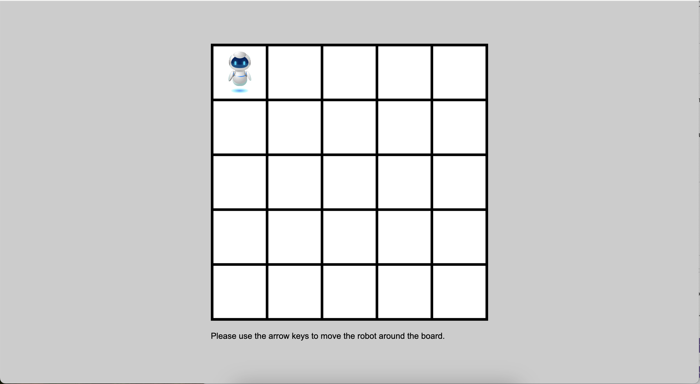

# Robot Control Simulation

## Features

- **Grid Layout:** The robot is placed on a 5x5 grid
- **Movement Controls:** Move the robot on the grid using **Arrow Keys (↑↓←→)**. When changing direction, the robot will rotate in the direction of the arrow key pressed.
- **Responsive Design:** The application is designed to run smoothly in modern web browsers.

## File Description
- `src/index.html`: The HTML file that contains the structure of the application
- `src/style.css`: The CSS file that contains the styling for the application
- `src/script.js`: The JavaScript file that contains the logic for the robot movement
- `src/assets`: The folder that contains the images used in the application

## Installation
- Clone the repository using SSH or HTTPS
- Navigate to the project directory `cd [your_path]/move-simulator/src` and open `index.html` in your browser

